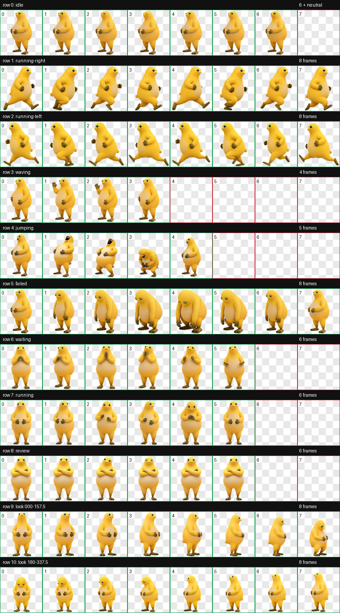
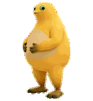
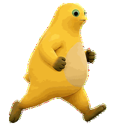
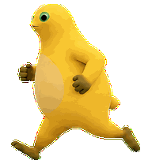
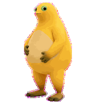
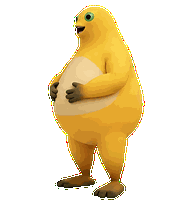
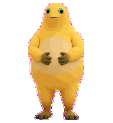
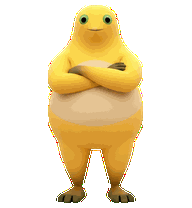
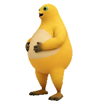
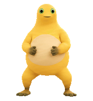

# 奶蛙 Codex Pet

一个可直接安装到 Codex Desktop 的奶蛙动态宠物，使用 v2 精灵图格式（8 列 × 11 行，单格 192 × 208）。



## 文件

- `pet.json`：宠物信息与 v2 格式声明
- `spritesheet.webp`：最终透明动画图集
- `preview.png`：动作预览，仅用于 GitHub 展示
- `gifs/standard/`：9 个 Codex 标准状态 GIF
- `gifs/extras/`：捧腹大笑完整版、打拳和八卦 GIF

GIF 只用于单独查看和 GitHub 展示；安装宠物时仍只需要 `pet.json` 与 `spritesheet.webp`。

## 安装

将 `pet.json` 和 `spritesheet.webp` 复制到：

```text
~/.codex/pets/naiwa/
```

Windows PowerShell 可在本仓库目录执行：

```powershell
$dest = Join-Path $HOME ".codex\pets\naiwa"
New-Item -ItemType Directory -Force -Path $dest | Out-Null
Copy-Item .\pet.json, .\spritesheet.webp -Destination $dest -Force
```

随后在 `~/.codex/config.toml` 的现有 `[desktop]` 段中设置：

```toml
[desktop]
selected-avatar-id = "custom:naiwa"
```

如果文件里已经有 `[desktop]`，只添加或修改 `selected-avatar-id`，不要重复创建该段。重新打开 Codex Desktop 或宠物浮层后即可使用。

## 动作映射

| Codex 状态 | 奶蛙动作 |
|---|---|
| `idle` | 待机 |
| `running-right` | 向右跑 |
| `running-left` | 向左跑 |
| `waving` | 挥手 |
| `jumping` / 鼠标悬浮 | 捧腹大笑 |
| `failed` | 失落 |
| `waiting` | 等待回应 |
| `running` | 专注处理任务 |
| `review` | 抱胸审阅 |
| 看向状态 | 16 个顺时针方向 |

注意：为适配 Codex 的标准触发协议，鼠标悬浮仍使用内部状态名 `jumping`，但播放内容已定制为“捧腹大笑”。

## GIF 动作预览

<table>
  <tr>
    <td align="center"><br>待机</td>
    <td align="center"><br>向右跑</td>
    <td align="center"><br>向左跑</td>
  </tr>
  <tr>
    <td align="center"><br>挥手</td>
    <td align="center"><br>悬浮：捧腹大笑</td>
    <td align="center"><br>失落</td>
  </tr>
  <tr>
    <td align="center"><br>等待回应</td>
    <td align="center"><br>专注处理</td>
    <td align="center"><br>抱胸审阅</td>
  </tr>
  <tr>
    <td align="center"><br>捧腹大笑完整版</td>
    <td align="center"><br>打拳</td>
    <td align="center"><br>八卦</td>
  </tr>
</table>

## 上传到 GitHub

```bash
git init
git add .
git commit -m "Add Naiwa Codex pet"
git branch -M main
git remote add origin <你的仓库地址>
git push -u origin main
```
